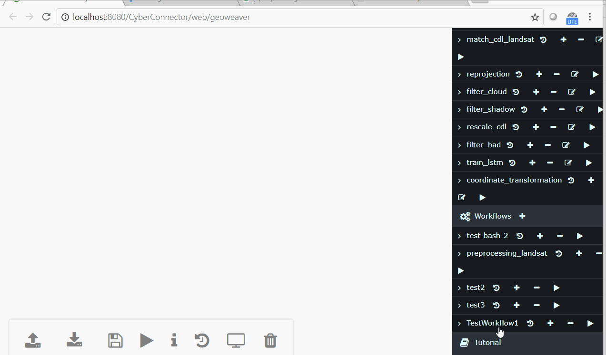
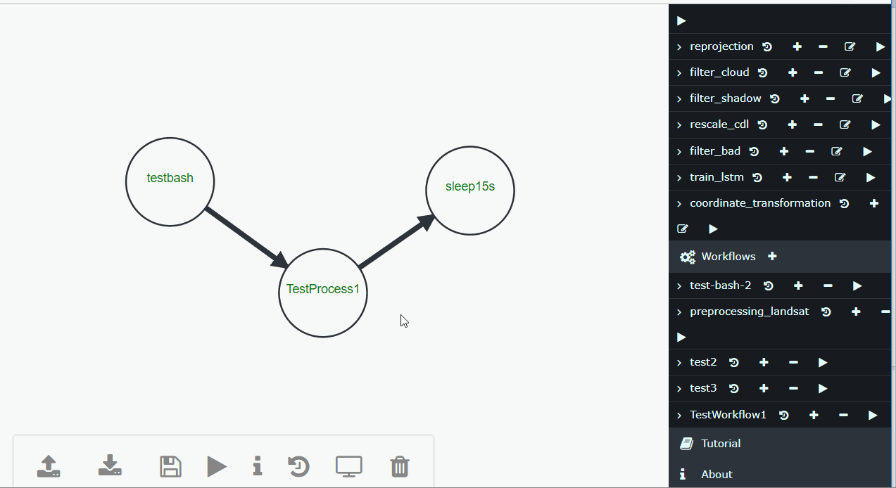

# Welcome to [Geoweaver](https://esipfed.github.io/Geoweaver/)

2018 ESIP Lab Incubator Project

Geoweaver is a web system allowing users to easily compose and execute full-stack deep learning workflows via taking advantage of online spatial data facilities, high-performance computation platforms, and open-source deep learning libraries. 

# Project Goals

1) turning large-scale distributed deep network into manageable modernized workflows;

2) boosting higher utilization ratio of the existing cyberinfrastructures by separating scientists from
tedious technical details;

3) enhancing the frequency and accuracy of classified land cover land use maps for agricultural purposes;

4) enabling the tracking of provenance by recording the execution logs in structured tables to evaluate the
quality of the result maps;

5) proof the effectiveness of operationally using large-scale distributed LSTM network in classifying
Landsat image time series.

# Installation

## Prerequisite

JDK 1.8+

Tomcat 8.0+

MySQL 5.5+ (run the gw.sql to initialize the database. Recommanded command: `mysql -u root -p < gw.sql`)

Maven 3.5+ (for building from source)

Docker 18.09.1+ (for install via docker)

Docker-compose 1.23.1+ (for install via docker)

## Quick Install

### Docker

We use `docker-compose` to establish the containers for Geoweaver. As the DockerHub is not very friendly for docker-compose yaml at present, we only suggest manual to start from GitHub repo. It only has three steps.

* Clone this repo to your machine 
```shell
git clone https://github.com/ESIPFed/Geoweaver.git
```
* Enter the repo and create a new folder `target`. Download a Geoweaver war package from the [release page](https://github.com/ESIPFed/Geoweaver/releases) and save it in the created `target` folder.
```shell
cd Geoweaver && mkdir target && cd target
wget https://github.com/ESIPFed/Geoweaver/releases/download/v0.6.10/Geoweaver-0.6.10.war -O Geoweaver.war
```

* Run docker to start rolling. After the command is finished, Geoweaver should be up and running. 

```shell
cd .. && docker-compose up -d
```

The address is:

```html
http://your-ip:your-port/Geoweaver/web/geoweaver
```

Replace the `your-ip`, `your-port` with the real domain of your tomcat. For example, `localhost:8080`.

Notice: Make sure the local services like mysql and tomcat are shut down before starting `docker-compose`. Otherwise there might be port conflict error on `3306` and `8080`. Or you can change the port to some other free ports in the docker-compose.yml.

If you don't have docker or docker-compose installed, these documents will help. [docker](https://docs.docker.com/install) [docker-compose](https://docs.docker.com/compose/install/)

To stop Geoweaver, type:
```shell
docker stop $(docker ps -aq)
```

### Tomcat War

* Download [the latest release war](https://github.com/ESIPFed/Geoweaver/releases) and copy it to the webapps directory of Tomcat (e.g. /usr/local/tomcat). Start Tomcat. 


```shell

wget https://github.com/ESIPFed/Geoweaver/releases/download/v0.6.10/Geoweaver-0.6.10.war -O Geoweaver.war
cp Geoweaver.war /usr/local/tomcat/webapps/
/usr/local/tomcat/bin/startup.sh

```

* After the tomcat is fully started, configure the database connection. The configuration files are `WEB-INF/classes/config.properties` 

```shell
nano /usr/local/tomcat/webapps/Geoweaver/WEB-INF/classes/config.properties
nano /usr/local/tomcat/webapps/Geoweaver/WEB-INF/classes/cc_secret.properties
```

Fill the fields with correct values. (database url, default: jdbc:mysql://localhost:3306/cyberconnector) and `WEB-INF/classes/cc_secret.properties` (database username and password: database_user=root database_password=xxxxxxxx). 

(**Note: the database must be initiated by the SQL file under the folder Geoweaver/docker/db first.**)

```shell
mysql -u root -p < docker/db/gw.sql
```

* Enter the following URL into browser address bar to open Geoweaver:
```html
http://your-ip:your-port/Geoweaver/web/geoweaver
```

To stop Geoweaver, use:
```shell
/usr/local/tomcat/bin/shutdown.sh
```

### Cloud VM Template

We provide a ready-to-use cloud template for you to install on mainstream cloud platforms like AWS, Google Cloud, Azure, OpenStack and CloudStack. Please go [here](http://cloud.csiss.gmu.edu/public/geoweaver-0.6.8.qcow2) to download the template (3.1 Gigabytes). The username and password of the instance would be `csiss` and `password` respectively. 

To start Geoweaver, go to directory /home/csiss/Geoweaver and execute docker-compose up -d. With no accident, Geoweaver will be up and running. 

```shell
cd /home/csiss/Geoweaver && docker-compose up -d
```

To stop Geoweaver, use:

```shell
docker stop $(docker ps -aq)
```

## Build from source

Use maven to build. In the command line go to the root folder and execute `mvn install`. After a success build, the Geoweaver war package will be under the directory: `Geoweaver/target/Geoweaver-<version>.war`. 

# Demo

A live demo site is available in George Mason University: [I am a link, hit me](http://129.174.131.229/geoweaver).

Here is a use case of Geoweaver, using deep neural network like LSTM RNN and SegNet to classify landsat images into agricultural land use maps. In this case, Geoweaver can help stakeholders get crop maps with better accuracy and high temporal resolution by providing a deep-learning-powered and distributed workflow system. 


## Usage

### Add A Server

Enroll a server to Geoweaver is simple. The server must have SSH server installed and enabled. The server must be accessible from Geoweaver host server. 


### Create A Process

Geoweaver supports Bash Shell scripts as processes. You can write bash command lines in the code area. Note: the commands should exist on the target hosts.


### Create A Workflow

Geoweaver can link the processes together to form a workflow. To connect two processes, press `shift` key while dragging from one process to another.


### Run Workflow

Geoweaver can run the created workflows on the enlisted servers. During the running, Geoweaver is monitoring the status of each process. The color of process text in their circles indicate the process status. Yellow means running, green means completed, and red means failure.



### Browse Provenance

Geoweaver stores all the inputs and outputs of each process run. Users can check the workflow provenance by simply clicking.


### Retrieve and Display Results

Geoweaver can retrieve the result files of the executed workflows and visualize them if the format is supported (png, jpg, bmp, etc. The list is expanding. I am on it.).



### I/O workflows

The workflows can be exported and move around and imported back.


# Documentation

[Project Proposal](docs/geoweaver-proposal-revised-v4.pdf)

[August Report](docs/ESIP-Geoweaver-Report-1.docx)

[September Report](docs/ESIP-Geoweaver-Report-2.docx)

[October Report](docs/ESIP-Geoweaver-Report-3.docx)

[November Report](docs/ESIP-Geoweaver-Report-4.docx)

## Open Source Libraries

This project is impossible without the support of several fantastic open source libraries.

[d3.js](https://github.com/d3/d3) - BSD 3-Clause

[graph-creator](https://github.com/cjrd/directed-graph-creator) - MIT License

[bootstrap](https://github.com/twbs/bootstrap) - MIT License

[CodeMirror](https://github.com/codemirror/CodeMirror) - MIT License

[JQuery Terminal](https://github.com/jcubic/jquery.terminal) - MIT License

## License

MIT

### Author

[developer list](authors.md)

